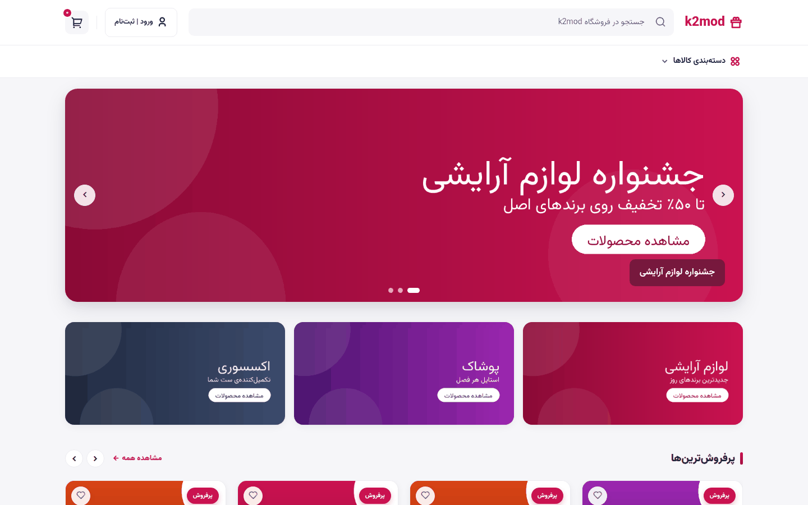
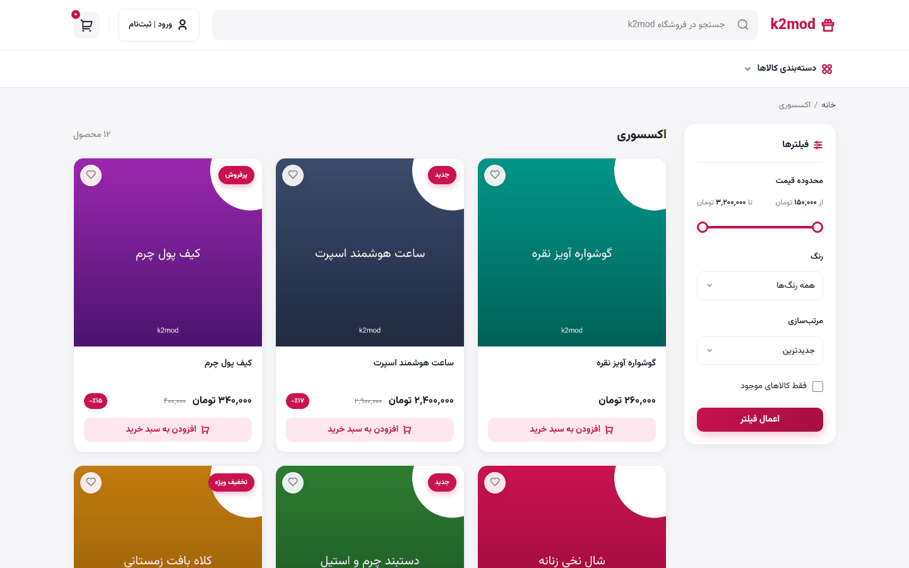
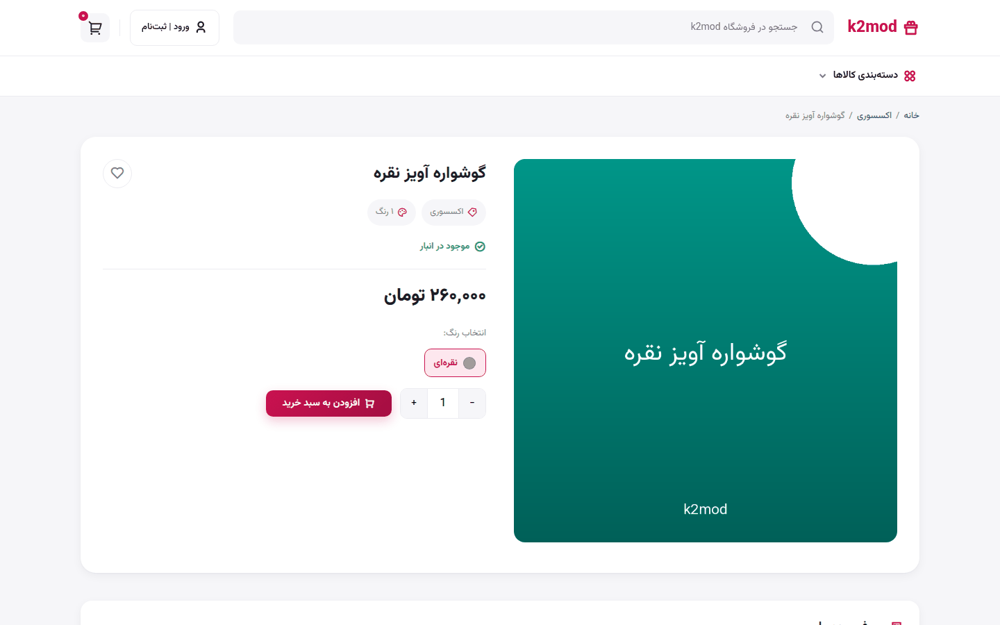
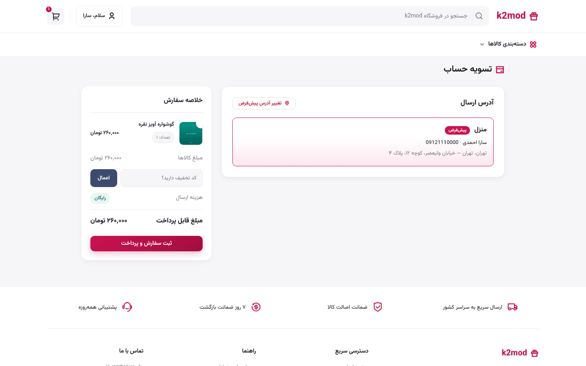
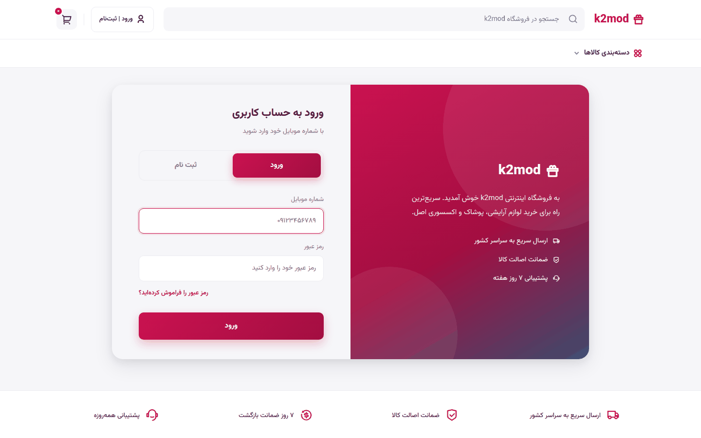
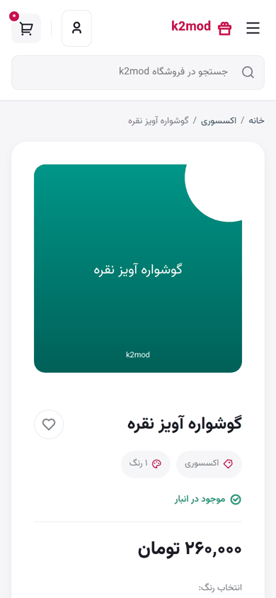
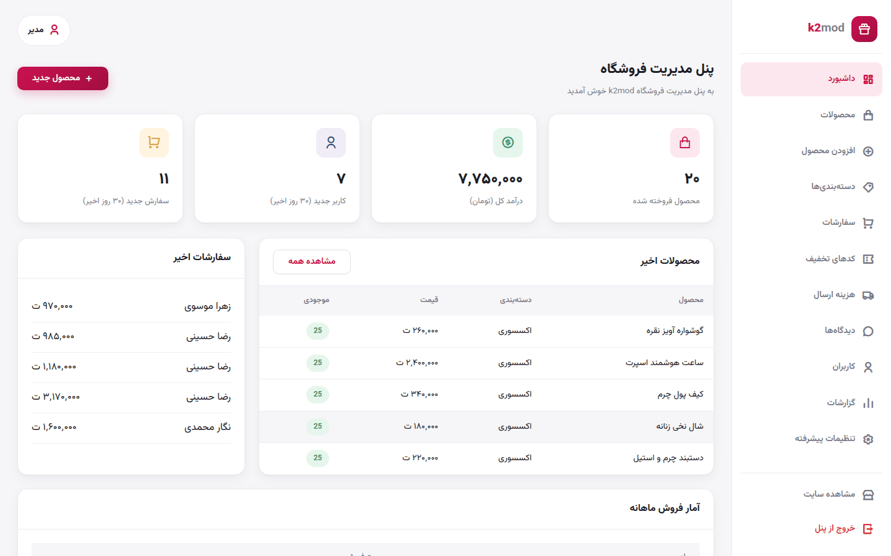
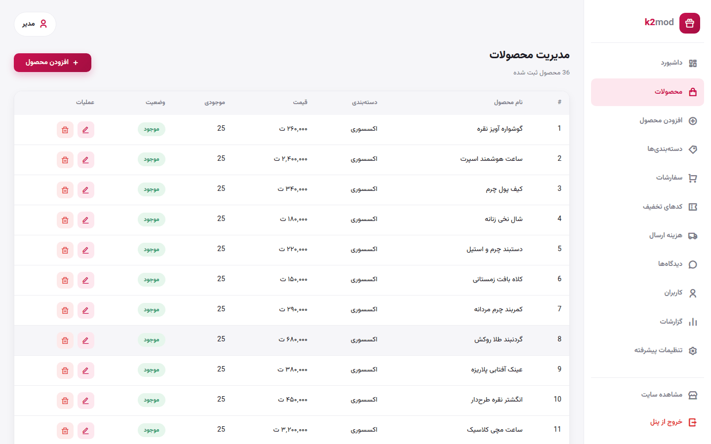
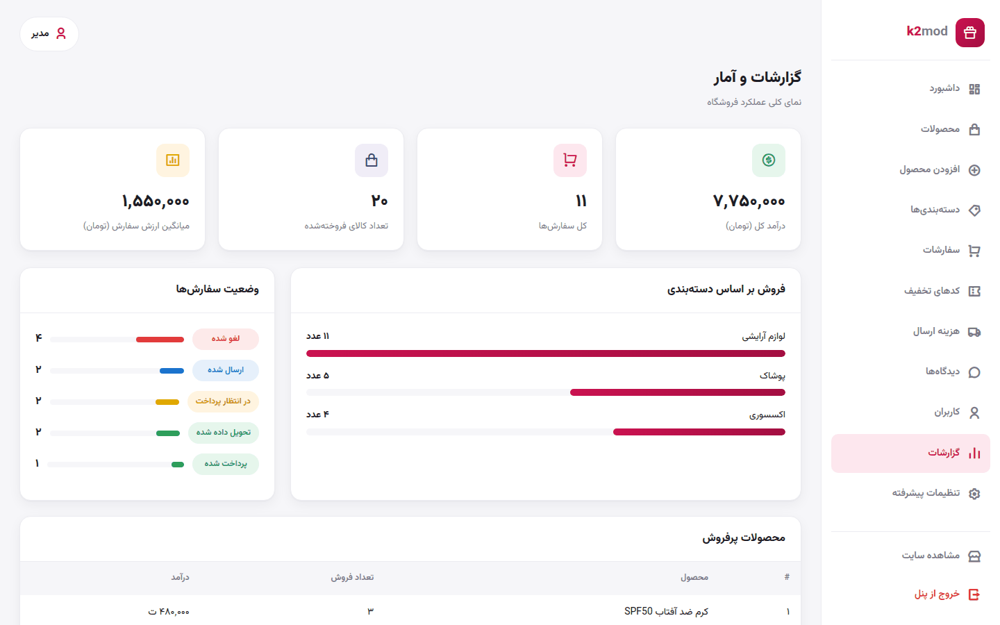

# k2mod

<p align="center">
  
</p>

<p align="center">
  <a href="#english">English</a> · <a href="#فارسی">فارسی</a>
</p>

---

## English

k2mod is an online store for gifts, cosmetics, clothing and accessories, built with Django. The site is in Persian (RTL), prices are in Toman and dates are Jalali.

**Live demo (home page only):** https://alisamadzadeh46.github.io/K2mod/

### Features

**Store**
- Sign up and log in with a mobile number, password reset by email
- Categories and subcategories, brands, colors and sizes
- Product listing with filters (price range, color, size, in stock) and sorting
- Product page with image gallery, color and size picker
- Search
- Wishlist
- Product comments with approval
- Guest cart
- Checkout with discount codes and shipping cost (free shipping above a set amount)
- Order history, order tracking code and saved addresses in the user account
- Responsive

**Custom admin panel**
- Dashboard with sales, orders, new users and recent activity
- Manage products (text editor, multiple images, SEO fields)
- Manage categories, brands and colors
- Orders: change status, set carrier and tracking code
- Discount codes (percentage or fixed amount, with a Jalali date picker)
- Shipping settings
- Comment moderation and replies
- User management (activate/deactivate, staff access)
- Sales reports

**Security**
- Login attempt limiting with django-axes
- Argon2 password hashing
- Admin URLs are set in `.env`

### Tech stack

- **Backend:** Python 3.14, Django 6.1
- **Database:** PostgreSQL 18
- **Frontend:** HTML, CSS, JavaScript (no frontend framework), Django templates
- **Server:** Docker, Nginx, Gunicorn
- **Icons & font:** Remix Icon, Vazirmatn
- **Other packages:** django-environ, django-axes, argon2-cffi, Pillow, jdatetime, arabic-reshaper, python-bidi

### Running with Docker

This is the easiest way. You only need Docker and Docker Compose.

```
browser → nginx (static, media) → gunicorn + django → postgresql
```

```bash
git clone https://github.com/alisamadzadeh46/k2mod.git
cd k2mod
cp .env.example .env            # on Windows: copy .env.example .env
```

Open `.env` and set at least these:

```
DEBUG=False
SECRET_KEY=a-long-random-string
DB_PASSWORD=a-strong-password
DJANGO_ADMIN_URL_PREFIX=something-hard-to-guess
USE_HTTPS=False
```

`USE_HTTPS=False` is only for testing on your own machine without SSL.

Then:

```bash
docker compose up -d --build
docker compose exec web python manage.py createsuperuser
docker compose exec web python manage.py seed_demo_data   # optional
```

The site is on http://localhost. If port 80 is busy, change `NGINX_PORT` in `.env`.

Migrations and `collectstatic` run automatically every time the container starts. Database, uploaded files and static files are kept in Docker volumes.

Useful commands:

```bash
docker compose logs -f web      # logs
docker compose down             # stop
docker compose up -d --build    # rebuild after changing the code
```

**On a real server:** set `USE_HTTPS=True`, put your domain in `ALLOWED_HOSTS` and `CSRF_TRUSTED_ORIGINS`, and use `nginx/ssl.conf.example` for the SSL certificate. The steps are written at the top of that file.

### Running without Docker

Requirements: Python 3.12+ and PostgreSQL.

```bash
python -m venv venv
source venv/bin/activate        # on Windows: venv\Scripts\activate
pip install -r requirements.txt
cp .env.example .env
```

Create a PostgreSQL database, fill in `SECRET_KEY`, `DB_USER`, `DB_PASSWORD` and `DJANGO_ADMIN_URL_PREFIX` in `.env` (keep `DEBUG=True`), then:

```bash
python manage.py migrate
python manage.py createsuperuser
python manage.py runserver
```

Open http://127.0.0.1:8000. The admin panel is at `/panel-control/` (can be changed with `DASHBOARD_URL_PREFIX`).

### Screenshots

| Home | Product list |
|---|---|
|  |  |

| Product page | Checkout |
|---|---|
|  |  |

| Login | Mobile |
|---|---|
|  |  |

**Admin panel**

| Dashboard | Products |
|---|---|
|  |  |



### Project structure

```
apps/
  accounts/    users, addresses, login and sign up
  catalog/     products, categories, banners, comments, wishlist
  cart/        shopping cart
  orders/      checkout, orders, discount codes, shipping
  payments/    payment gateway layer
  dashboard/   custom admin panel
  common/      shared validators and template filters
k2_store/      settings and main urls
templates/
static/
docker/        entrypoint and gunicorn config
nginx/         nginx config (http and https example)
Dockerfile
docker-compose.yml
```

---

<div dir="rtl">

## فارسی

k2mod  فروشگاه اینترنتی برای فروش کادو، لوازم آرایشی، پوشاک و اکسسوریه که با جنگو نوشته شده. سایت فارسی و راست‌چینه، قیمت‌ها به تومان و تاریخ‌ها شمسی.

**دموی آنلاین (فقط صفحه اصلی):** https://alisamadzadeh46.github.io/K2mod/

### امکانات

**فروشگاه**
- ثبت‌نام و ورود با شماره موبایل، بازیابی رمز عبور از طریق ایمیل
- دسته‌بندی و زیردسته، برند، رنگ و سایز
- لیست محصولات با فیلتر (بازه‌ی قیمت، رنگ، سایز، کالاهای موجود) و مرتب‌سازی
- صفحه‌ی محصول با گالری تصاویر و انتخاب رنگ و سایز
- جستجو
- لیست علاقه‌مندی‌ها
- ثبت نظر برای محصولات (بعد از تأیید مدیر نمایش داده می‌شه)
- سبد خرید برای کاربر مهمان
- تسویه حساب با کد تخفیف و هزینه‌ی ارسال (ارسال رایگان بالای یه مبلغ مشخص)
- تاریخچه‌ی سفارش‌ها، کد رهگیری مرسوله و مدیریت آدرس‌ها توی حساب کاربری
- ریسپانسیو

**پنل مدیریت اختصاصی**
- داشبورد با آمار فروش، سفارش‌ها، کاربرهای جدید و آخرین فعالیت‌ها
- مدیریت محصولات (ویرایشگر متن، چند تصویر، فیلدهای سئو)
- مدیریت دسته‌بندی‌ها، برندها و رنگ‌ها
- سفارش‌ها: تغییر وضعیت، ثبت شرکت حمل و کد رهگیری
- کدهای تخفیف (درصدی یا مبلغ ثابت، با تقویم شمسی)
- تنظیمات هزینه‌ی ارسال
- تأیید نظرها و پاسخ دادن بهشون
- مدیریت کاربرها (فعال و غیرفعال کردن، دادن دسترسی مدیریت)
- گزارش فروش

**امنیت**
- محدود کردن تلاش‌های ناموفق ورود با django-axes
- هش رمز عبور با Argon2
- آدرس پنل مدیریت از `.env` تنظیم می‌شه

### تکنولوژی‌های استفاده‌شده

- **بک‌اند:** Python 3.14 و Django 6.1
- **دیتابیس:** PostgreSQL 18
- **فرانت‌اند:** HTML، CSS، JavaScript (بدون فریم‌ورک) و قالب‌های جنگو
- **سرور:** Docker، Nginx و Gunicorn
- **آیکون و فونت:** Remix Icon و وزیرمتن
- **پکیج‌های دیگه:** django-environ، django-axes، argon2-cffi، Pillow، jdatetime، arabic-reshaper، python-bidi

### اجرا با داکر

ساده‌ترین روش اجرا همینه و فقط Docker و Docker Compose لازمه.

</div>

```
browser → nginx (static, media) → gunicorn + django → postgresql
```

```bash
git clone https://github.com/alisamadzadeh46/k2mod.git
cd k2mod
copy .env.example .env          # on Linux/macOS: cp .env.example .env
```

<div dir="rtl">

فایل `.env` رو باز کنید و حداقل این‌ها رو پر کنید:

</div>

```
DEBUG=False
SECRET_KEY=a-long-random-string
DB_PASSWORD=a-strong-password
DJANGO_ADMIN_URL_PREFIX=something-hard-to-guess
USE_HTTPS=False
```

<div dir="rtl">

`USE_HTTPS=False` فقط برای تست روی سیستم خودتون و بدون SSL هست.

بعد:

</div>

```bash
docker compose up -d --build
docker compose exec web python manage.py createsuperuser
docker compose exec web python manage.py seed_demo_data   # optional
```

<div dir="rtl">

سایت روی http://localhost بالا میاد. اگه پورت 80 اشغاله، `NGINX_PORT` رو توی `.env` عوض کنید.

مایگریشن‌ها و `collectstatic` هر بار که کانتینر بالا میاد خودکار اجرا می‌شن. دیتابیس، فایل‌های آپلودی و فایل‌های استاتیک توی volumeهای داکر نگه داشته می‌شن.

دستورهای کاربردی:

</div>

```bash
docker compose logs -f web      # logs
docker compose down             # stop
docker compose up -d --build    # rebuild after changing the code
```

<div dir="rtl">

**روی سرور واقعی:** `USE_HTTPS=True` بذارید، دامنه رو توی `ALLOWED_HOSTS` و `CSRF_TRUSTED_ORIGINS` وارد کنید و برای گواهی SSL از فایل `nginx/ssl.conf.example` استفاده کنید. مراحلش بالای همون فایل نوشته شده.

اگه موقع build به Docker Hub دسترسی ندارید، باید یه registry mirror توی تنظیمات داکر اضافه کنید.

### اجرا بدون داکر

پیش‌نیازها: Python 3.12 به بالا و PostgreSQL

</div>

```bash
python -m venv venv
venv\Scripts\activate           # on Linux/macOS: source venv/bin/activate
pip install -r requirements.txt
copy .env.example .env          # on Linux/macOS: cp .env.example .env
```

<div dir="rtl">

یه دیتابیس PostgreSQL بسازید، مقدارهای `SECRET_KEY`، `DB_USER`، `DB_PASSWORD` و `DJANGO_ADMIN_URL_PREFIX` رو توی `.env` پر کنید (`DEBUG=True` بمونه) و بعد:

</div>

```bash
python manage.py migrate
python manage.py createsuperuser
python manage.py runserver
```

<div dir="rtl">

بعد آدرس http://127.0.0.1:8000 رو باز کنید. پنل مدیریت روی `/panel-control/` هست (با `DASHBOARD_URL_PREFIX` قابل تغییره).

برای اضافه کردن چند محصول نمونه:

</div>

```bash
python manage.py seed_demo_data
```

<div dir="rtl">

### تصاویر

تصاویر در [بخش Screenshots](#screenshots).

</div>
